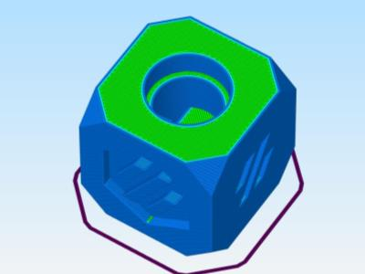

# Simplify3D Thumbnail Generator for PrusaThumbnail plugin on OctoPrint/MainsailOS.

#### Windows only

1. Download and place the executeable on your system somewhere with permissions allowing Simplify3D to access.
    `git clone https://github.com/boweeble/s3d-thumbnail-generator.git`

2. You will need to figure out where to crop on your screen size. If your resolution is 1920x1080 then it should already work fine with the default settings as long as Simplify3D is maximized. You'll have to play with these to figure out the best settings for your resolution otherwise.
    `x=532 y=118 w=953 lw=400 lh=300 sw=32 sh=32`
   
3. Open Simplify3D and input the location of your script into the post-processing tab.
   `c:\S3D_Thumbs\S3D_Thumbs.exe f=[output_filepath]`

   

4. Slice something executeable will run and insert your thumbnail into the gcode.  If you want to save a copy of the thumbnail as a JPEG you can do that by adding the `d=n` option.

 
 

5. Upload to your gcode to OctoPrint or MainsailOS instance that has the appropriate PrusaThumbnail plugin installed.
    OctoPrint: [https://plugins.octoprint.org/plugins/prusaslicerthumbnails/](https://plugins.octoprint.org/plugins/prusaslicerthumbnails/)
    MainsailOS: [https://github.com/emtrax-ltd/Cura2MoonrakerPlugin](https://github.com/emtrax-ltd/Cura2MoonrakerPlugin)

6. Enjoy!

### Options:
 f: filename with full path
 x: x position to crop (optional - default is 532)
 y: y position to crop (optional - default is 118)
 w: width to crop (optional - default is 953)
 lw: large thumbnail width (optional - default is 400)
 lh: large thumbnail height (optional - default is 300)
 sw: small thumbnail width (optional - default is 32)
 sh: small thumbnail height (optional - default is 32)
    height will scale automatically based on height
 d: [Y or N] delete temporary thumbnail (default is 'Y')
    saved in same directory as gcode (s3d_cropped.jpg)
   
#### Notes: If you feel this has been useful to you feel free to buy me a beer via Venmo @boweeble
