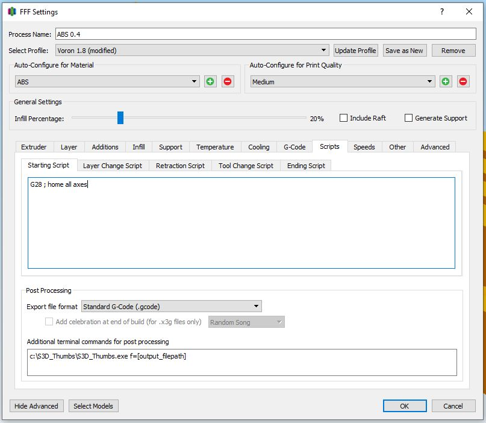
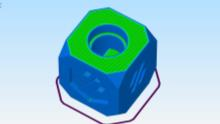

### S3D Thumbnail Generator for PrusaThumbnail plugin on OctoPrint/MainsailOS and possibly others.

#### Windows only currently

1. Download and place the executeable on your system somewhere with permissions allowing S3D to access.
   `git clone https://github.com/boweeble/s3d-thumbnail-generator.git`

2. You will need to figure out where to crop on your screen size. If your resolution is 1920x1080 then it should already work fine with the default settings as long as Simplify3D is maximized. You'll have to play with these to figure out the best settings for your resolution otherwise.
   `x=404 y=135 w=1265 tw=220 th=124`

5. Open Simplify3D and input the location of your script into the post-processing tab.
  `c:\S3D_Thumbs\S3D_Thumbs.exe f=[output_filepath]`
   

6. Slice something executeable will run and insert your thumbnail into the gcode.  If you want to save a copy of the thumbnail as a JPEG you can do that by adding the `d=n` option.

7. Upload to your gcode to OctoPrint or MainsailOS instance that has the PrusaThumbnail plugin installed.
   `https://plugins.octoprint.org/plugins/prusaslicerthumbnails/`

8. Enjoy!
   

#### Notes: If you feel this has been useful to you feel free to buy me a beer via Venmo @boweeble
